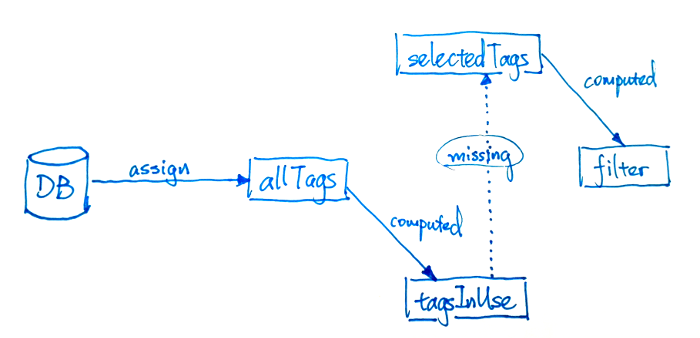

# Build the Missing Notifying Chain

Firstly, a graph like this might be helpful.

Ways to add the notifying mechanism between reactive data objects:
* assign (reference replacing)
* call `$set` method
* computed
* watch & assign
