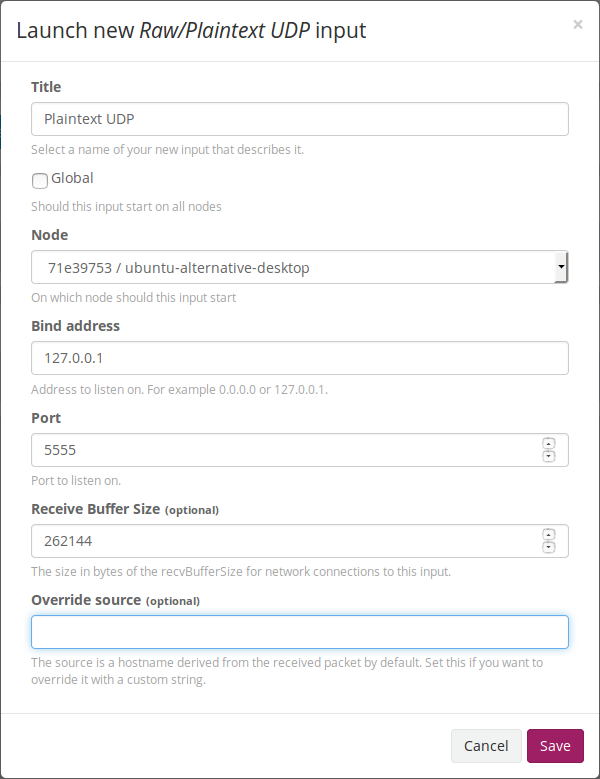

# Install Graylog on Ubuntu

Currently I'm using Ubuntu 14.04.4 and installing Graylog 2.0.

Graylog is not easy to install. To install it on Ubuntu, the system should meet following prerequisites:

  * Java (>= 8);
  * MongoDB (>= 2.4);
  * Elasticsearch (>= 2.x);

The installation of prerequisites will not be covered in this article.

### Install Graylog Server

After that, run the following commands:

  ```console
$ sudo apt-get install apt-transport-https
$ wget https://packages.graylog2.org/repo/packages/graylog-2.0-repository_latest.deb
$ sudo dpkg -i graylog-2.0-repository_latest.deb
$ sudo apt-get update
$ sudo apt-get install graylog-server
  ```

After installation AND CONFIGURATION, we could use following command to start Graylog:

  ```console
$ sudo start graylog-server
  ```

### Configure Graylog to Bring the Web Interface Up

However, we should firstly do some configurations.

Firstly, we should generate a secret key to secure the stored user passwords:

  ```console
$ sudo apt-get install pwgen
$ pwgen -N 1 -s 96
  ```

Copy and paste the result to the file `/etc/graylog/server/server.conf`, after the line starting with `password_secret =`:

  ```text
# You MUST set a secret to secure/pepper the stored user passwords here. Use at least 64 characters.
# Generate one by using for example: pwgen -N 1 -s 96
password_secret = FKGtAkgFbXAJrLBC90DvWBEn6TG0h0PyZ23qdxlq56uoS81sPvtg1HtdTAGfxJDTBAxafQcrZ1c6cvvIti1TK4UC3iI8lryL
  ```

And then, we should set a root password:

  ```console
$ echo -n newpassword | shasum -a 256
  ```

Copy and paste the result to the file `/etc/graylog/server/server.conf`, after the line starting with `root_password_sha2 =`:

  ```text
# You MUST specify a hash password for the root user (which you only need to initially set up the
# system and in case you lose connectivity to your authentication backend)
# This password cannot be changed using the API or via the web interface. If you need to change it,
# modify it in this file.
# Create one by using for example: echo -n yourpassword | shasum -a 256
# and put the resulting hash value into the following line
root_password_sha2 = 5912d5590ceedd61724ee20d37b515427916c915081bccad29e0c684476014c4
  ```

Notice that there shouldn't be a `-` after the sha2 code.

Next step, in the same configuration file, change the Elasticsearch shards number to 1:

  ```text
# How many Elasticsearch shards and replicas should be used per index? Note that this only applies to newly created indices.
elasticsearch_shards = 1
  ```

Now save this file and start graylog. Keep an eye on the log file, check if there is any errors.

Go to the web browser, type `localhost:9000` into the address box and there will be a login interface. Input the root username (default `admin`) and the root password, then we will log in into the Graylog web interface.

### Setup the Connection to Elasticsearch

After read the notifications, we know that the Elasticsearch cluster is unavailable. So next step is to configure the Graylog so that it works with Elasticsearch.

There are several lines in the file `/etc/graylog/server/server.conf` related to the Elasticsearch connection:

  ```text
# settings to be passed to elasticsearch's client (overriding those in the provided elasticsearch_config_file)
# all these
# this must be the same as for your Elasticsearch cluster
elasticsearch_cluster_name = elasticsearch

...

# A comma-separated list of Elasticsearch nodes which Graylog is using to connect to the Elasticsearch cluster,
# see https://www.elastic.co/guide/en/elasticsearch/reference/2.3/modules-discovery-zen.html for details.
# Default: 127.0.0.1
elasticsearch_discovery_zen_ping_unicast_hosts = 127.0.0.1:9300

...

# Enable Elasticsearch multicast discovery. This requires the installation of an Elasticsearch plugin,
# see https://www.elastic.co/guide/en/elasticsearch/plugins/2.3/discovery-multicast.html for details.
# Default: false
elasticsearch_discovery_zen_ping_multicast_enabled = false
  ```

The first section is to set the cluster name to be used.

The second one specifies the nodes in the cluster (I guess). Notice that, here the port should be 9300 because the port 9200 is only for REST API, and if Java API is used, 9300 is required.

The third part disables the multicast node searching.

Then restart the Graylog with:

  ```console
$ sudo restart graylog-server
  ```

The notification about Elasticsearch will disappear now.

### Set Node Inputs

There is still a notification telling us, that there is a node without any running inputs. To fix this, follow the steps below:

  1. go to Graylog Web Interface, click `System --> Inputs`;
  2. select `Raw/Plaintext UDP` in the drop list and click `Launch new input`;
  3. configure the new input like this:<br/>
    
  4. click `Save`.

