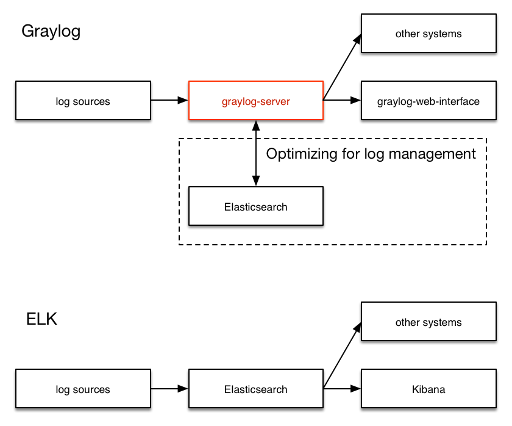

# Internal Structure of Graylog

Picture resources come from the [official document](http://docs.graylog.org/en/2.0/pages/ideas_explained.html) of Graylog.

Graylog is heavily inspired by Splunk, so they have similar structures. The structure of Graylog is shown below:

  * The `graylog-server` is the heart of the system. According to the official document, it works around shortcomings of Elasticsearch (a full text search engine, not a log management system) for log management.
  * The `log sources` part could have multiple solutions, including the application actively pushing the log messages with a GELF client, or a Logstash service reading the log files and push them to `graylog-server`.
  * Just like Kibana, in Graylog, there is a `graylog-web-interface` to simplify the querying and visualize the results.

Comparing to ELK, Graylog just replaces the Elasticsearch part with a `graylog-server` built around it, and replaces Kibana with a more sophisticated Web interface.
