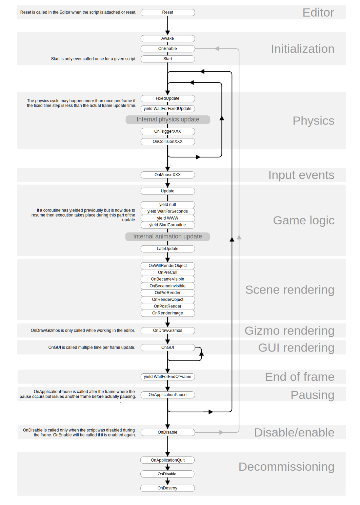

# Event Callback Functions

There is an image from the [official document](https://docs.unity3d.com/Manual/ExecutionOrder.html) about execution order of event functions, which is very helpful to answer the question "where should I put my game logic code".

